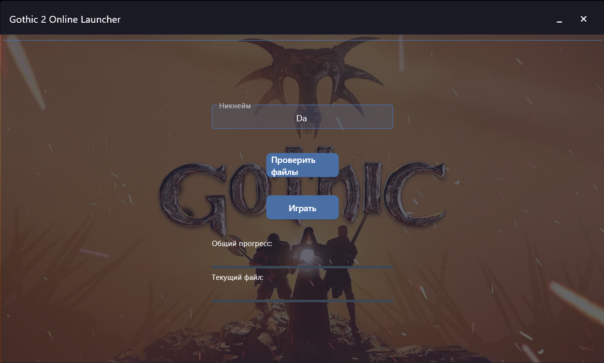

# G2OCustomLauncher

  

 <!-- Добавьте скриншот в папку static -->

  

Лаунчер для автоматической проверки и загрузки файлов игры перед запуском.

  

## 🔧 Основные функции

  

| Функция | Описание |

|---------|----------|

| ✅ Проверка файлов | Сравнивает хеш-суммы всех файлов игры |

| ⬇️ Загрузка | Автоматически загружает недостающие файлы |

| 🧑‍💻 Тестовый режим | Локальная проверка без реальных загрузок |

| 🔒 Безопасность | Требует прав администратора |

  

## 🛠 Настройка тестового режима

  

1. Создайте папку `test_files` в корне проекта

2. Поместите туда файлы игры:
```
/test_files
├── /DATA
│ 	├── font_high_resolution.vdf
│ 	├── gui.vdf
│ 	└── ...
│
└── /System.exe
    └── Gothic2.exe
```
3. В `config.toml` укажите:
```toml
[game]
test_source_folder = "test_files"
```

## Конфигурация

Основные настройки в `config.toml`:
```
[app]
title = "Мой Лаунчер"  # Название в заголовке
width = 800           # Ширина окна
height = 600          # Высота окна

[game]
executable = "Gothic2.exe"  # Полный путь к игре
server_address = "127.0.0.1:7777"  # IP сервера
```
## Требования

-   Python 3.12+
-   Установленные пакеты из файла requirements.txt
-   Права администратора

## Запуск
Требуется создать манифест файлов игры, для этого выполните действия:
1. В конце файла `files_report.py` укажите путь до директории с игровыми файлами (должна быть в папке с main.py)
2.  Запустите:
	```bash
	python files_report.py
	```
3. Запустите лаунчер:
	```bash
	python main.py
	```
## Для использования в проде
Установить `test_mode = False` в классе Downloader
